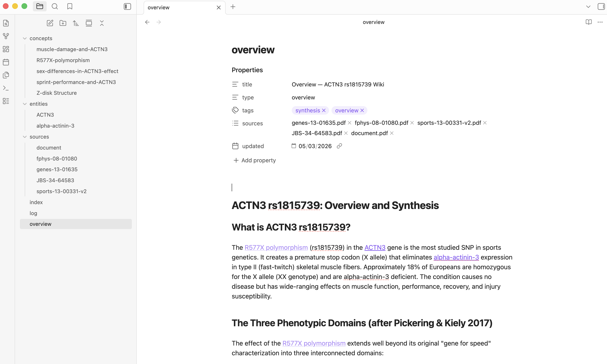
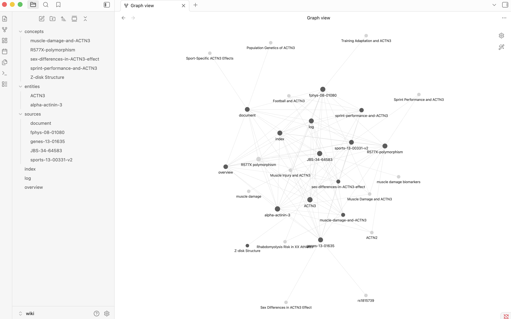

The [LLM wiki](https://gist.github.com/karpathy/442a6bf555914893e9891c11519de94f) by Andrej Karpathy has been gaining a lot of traction. The core idea is to use an LLM to incrementally index, organize, query, and maintain a persistent wiki. Unlike a static document dump or a typical RAG setup, the output is a structured, human-readable knowledge base that grows alongside your understanding.

The interesting part is that you're using an LLM to interact with your knowledge base dynamically — not just retrieving answers, but actively reorganizing and extending what's there. Ask a good question, and the answer becomes part of the wiki. The knowledge base compounds.

So I decided to give this a try, using the ACTN3 gene and the rs1815739 variant as an example.

### Collect Raw Data

To get started, I needed to collect some information on the gene first. I started with a Google search and downloaded a few of the top papers. If you already have an existing project with papers, slides, notebooks, etc., just collect everything into a folder.

```
ACTN3/
├── raw/
    ├── xxx.pdf
    └── ...
```

### Initiate the LLM Wiki

The original llm-wiki post has clear instructions and enough background information already, which can be directly used by your coding agent as a set of rules. So to start, I simply copied the markdown file to the project root folder.

```
ACTN3/
├── raw/
│   ├── xxx.pdf
│   └── ...
└── llm-wiki.md
```

Run `/init` from the root folder using Claude or whichever coding agent you prefer. For Claude, it can understand the purpose of the project right away and rewrite it as a project-specific guideline.

```
ACTN3/
├── raw/
│   ├── xxx.pdf
│   └── ...
├── CLAUDE.md
└── llm-wiki.md
```

### Indexing Your Initial Raw Files

After that, run `Ingest` in Claude, and you'll get an organized wiki folder with an overview page and relevant entity, source, and concept pages like this.


```
ACTN3/
├── CLAUDE.md
├── llm_wiki.md
├── raw/
│   ├── xxx.pdf
│   └── ...
└── wiki/
    ├── index.md
    ├── log.md
    ├── overview.md
    ├── concepts/
    │   ├── xxx.md
    │   └── ...
    ├── entities/
    │   ├── xxx.md
    │   └── ...
    └── sources/
    │   ├── xxx.md
    │   └── ...
```

### Visualize Your Wiki

[Obsidian](https://obsidian.md/) is what made this wiki feel fun. Since the wiki is just interlinked markdown files, you can open the wiki folder as a vault in Obsidian and check the graph view for all the connections between concepts, entities, and sources. 





### Continue Building Your Wiki

It doesn't have to stop here. As you add more documents to the raw folder, have your coding agent `Ingest` again. As you write down your own notes about this topic, add them to raw or to the wiki directly. Another interesting way to grow the wiki is to `Query` it — good questions and answers get added back and become part of the knowledge base.

### And Now What...

LLM makes building the knowledge base easy, but making sense of what's collected is more crucial than ever. We're not building the tool just to build it — we're building it so we can actually understand the science and push it forward. The LLM can help organize and connect the dots, but the understanding still has to come from you.

The wiki is most useful when you treat it as a thinking partner, not a filing cabinet. Open it before a paper review — what gaps does it surface? Query it before writing — what do you actually know versus what you vaguely remember reading? Use it to stress-test a hypothesis: ask the wiki to argue against you.

The goal isn't a comprehensive wiki. It's a sharper understanding of the problem you're working on. The wiki just makes that process faster and more honest. As I recently heard someone say, "You can outsource thinking but not understanding."

### In Summary

Before this, my research notes lived in scattered folders — papers I half-remembered, highlights I never went back to, concepts I thought I understood until I had to explain them. This wiki didn't just organize that mess, it made me realize how much I had collected without actually absorbing.

The gene was just an excuse to try it. What I actually got out of it was a clearer picture of what I know, what I'm fuzzy on, and what questions I hadn't thought to ask yet. That's harder to get from a folder of PDFs.