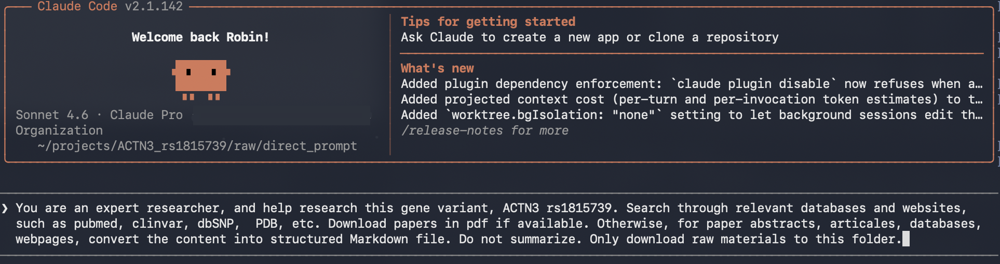
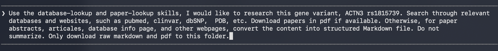

In my last blog post, I tried to start a personal knowledge base to help me build my understanding around a topic. One of the key inputs is raw materials to feed into the knowledge base. So this time, I am going to try a couple of different ways of gathering that raw data. I used Claude Code for my project, but any AI agent should work similarly.

## Key comparison

TL;DR These are the main methods I tried, and here is the key comparison, with more details below.
<table style="border-collapse: collapse; width: 100%; font-size: 0.9rem; margin-bottom: 1.5em;">
  <thead>
    <tr style="background-color: #f0f0f0;">
      <th style="border: 1px solid #ccc; padding: 8px 12px; text-align: left; width: 16%;"></th>
      <th style="border: 1px solid #ccc; padding: 8px 12px; text-align: left; width: 28%;">Prompt Directly</th>
      <th style="border: 1px solid #ccc; padding: 8px 12px; text-align: left; width: 28%;">Research Mode</th>
      <th style="border: 1px solid #ccc; padding: 8px 12px; text-align: left; width: 28%;">Use Skills</th>
    </tr>
  </thead>
  <tbody>
    <tr><td style="border: 1px solid #ccc; padding: 8px 12px;"><strong>Time</strong></td><td style="border: 1px solid #ccc; padding: 8px 12px;">~1 hr</td><td style="border: 1px solid #ccc; padding: 8px 12px;">Fast</td><td style="border: 1px solid #ccc; padding: 8px 12px;">Moderate</td></tr>
    <tr style="background-color: #f9f9f9;"><td style="border: 1px solid #ccc; padding: 8px 12px;"><strong>PDFs retrieved</strong></td><td style="border: 1px solid #ccc; padding: 8px 12px;">14</td><td style="border: 1px solid #ccc; padding: 8px 12px;">None</td><td style="border: 1px solid #ccc; padding: 8px 12px;">7</td></tr>
    <tr><td style="border: 1px solid #ccc; padding: 8px 12px;"><strong>Markdown files</strong></td><td style="border: 1px solid #ccc; padding: 8px 12px;">12 DB files</td><td style="border: 1px solid #ccc; padding: 8px 12px;">None</td><td style="border: 1px solid #ccc; padding: 8px 12px;">14 papers + 11 DB files</td></tr>
    <tr style="background-color: #f9f9f9;"><td style="border: 1px solid #ccc; padding: 8px 12px;"><strong>Returns raw content</strong></td><td style="border: 1px solid #ccc; padding: 8px 12px;">Partial</td><td style="border: 1px solid #ccc; padding: 8px 12px;">No — always summarizes</td><td style="border: 1px solid #ccc; padding: 8px 12px;">Yes</td></tr>
    <tr><td style="border: 1px solid #ccc; padding: 8px 12px;"><strong>Breadth of sources</strong></td><td style="border: 1px solid #ccc; padding: 8px 12px;">Limited</td><td style="border: 1px solid #ccc; padding: 8px 12px;">Very broad</td><td style="border: 1px solid #ccc; padding: 8px 12px;">Good</td></tr>
    <tr style="background-color: #f9f9f9;"><td style="border: 1px solid #ccc; padding: 8px 12px;"><strong>Cost</strong></td><td style="border: 1px solid #ccc; padding: 8px 12px;">Time-intensive</td><td style="border: 1px solid #ccc; padding: 8px 12px;">Exhausts pro plan quota</td><td style="border: 1px solid #ccc; padding: 8px 12px;">Moderate</td></tr>
    <tr><td style="border: 1px solid #ccc; padding: 8px 12px;"><strong>API keys required</strong></td><td style="border: 1px solid #ccc; padding: 8px 12px;">No</td><td style="border: 1px solid #ccc; padding: 8px 12px;">No</td><td style="border: 1px solid #ccc; padding: 8px 12px;">Yes (for full potential)</td></tr>
    <tr style="background-color: #f9f9f9;"><td style="border: 1px solid #ccc; padding: 8px 12px;"><strong>Ease of use</strong></td><td style="border: 1px solid #ccc; padding: 8px 12px;">Easy</td><td style="border: 1px solid #ccc; padding: 8px 12px;">Easy</td><td style="border: 1px solid #ccc; padding: 8px 12px;">Medium</td></tr>
    <tr><td style="border: 1px solid #ccc; padding: 8px 12px;"><strong>Best for</strong></td><td style="border: 1px solid #ccc; padding: 8px 12px;">Quick first pass</td><td style="border: 1px solid #ccc; padding: 8px 12px;">Landscape survey</td><td style="border: 1px solid #ccc; padding: 8px 12px;">Systematic collection</td></tr>
  </tbody>
</table>
  

## The good old days

It's been a while since I was in the deep research world. How I did literature reviews back in the day was relatively simple: Google, PubMed, plus relevant databases. You start by searching keywords, read the top hits, download the papers, then search for more based on authors and references, find new keywords, download more, read more — and repeat until you feel like you've seen everything. Depending on the size of the topic, this can take anywhere from a couple of days to a couple of months. And if you are lucky, by the end of it, you may still remember the first paper you read. 

## Prompt directly

To prompt with an AI agent, I basically put what I just described above directly into the prompt. Based on my prior knowledge, I wanted to pull information from a few sites such as PubMed, ClinVar, dbSNP, PDB, ClinicalTrials, etc. Here is how I prompted Claude Code:

To my surprise, the whole process took over an hour to finish, given that I was still following the Zero Trust principle with Claude. And the results were just OK at best. It was only able to find 14 full-text PDFs and 12 structured Markdown files from databases. It seemed to spend most of the time finding APIs to download papers and summarizing database findings, even though I asked it to export raw webpages directly as Markdown files.

## Use agent research mode

My understanding is that research mode in Claude and other AI agent tools is geared toward broader research tasks - market analytics, for example - rather than finding scientific papers specifically. But I figured it was worth a try. You will need the desktop app or the Claude website to use research mode, i.e., it is not available in Claude Code. Here is the prompt I used, and the results were kind of both good and bad.

  
  

The good part: it was able to search through a pretty comprehensive list of websites and databases. It covered different categories including scientific papers and abstracts, genetic and genomic databases, and web pages from universities, institutes, and science communicators, finishing with a synthesis of current understanding and open questions. It was even able to specifically identify conflicting and null results, which I find most interesting. By reading through its summary and conclusion, one can quickly get up to speed on a new topic.

If I were not looking to download raw materials, this would be a great way to quickly survey the landscape of a new domain. It appears to be on par with some of the AI research agents I've seen designed specifically for this purpose. It is probably one of those examples of Agents Over Apps — apps becoming obsolete due to the rapid advancement of multimodal models.

The bad part: this one prompt basically exhausted my Claude Pro plan quota. On top of that, I could not get Claude to download the raw source papers or webpages — it insists on summarizing everything no matter how I prompt it. While it listed all the references it used in the final summary, I specifically asked for the actual papers and raw webpage exports to minimize hallucination, yet it seems nearly impossible to get an LLM to not summarize.

## Use Skills

I like to think of skills for agents as the equivalent of `import` in Python or `library` in R. By using pre-built skills, you can quickly access specialized capabilities without having to hardcode all the detailed instructions in your prompt. I looked for skills that specialize in scientific research, and the one I found was called [scientific-agent-skills](https://github.com/K-Dense-AI/scientific-agent-skills). At first glance, there appear to be lots of useful skills in there, especially for bioinformatics research. To be cautious, I didn't install the whole repo - I just copied the ones I was interested in, `database-lookup` and `paper-lookup`, to the `.claude` folder under my project root so they are only available to this project. (This reminds me of setting up a virtual environment to keep Python package versions contained per project.) After that, I can call these skills directly from the Claude Code CLI.

In the end, it retrieved 7 PDF papers, 14 full-text Markdown papers (where PDF download wasn't available), and 11 database Markdown files - including dbSNP, ClinVar, GWAS Catalog, NCBI Gene, UniProt, PDB structures (1TJT/1WKU), AlphaFold, gnomAD, Open Targets, a PubMed paper list, and PubMed abstracts. Not a bad first pass. It also followed the instructions to return raw responses from websites without summarizing everything.

One caveat: you do need to set up API keys for each database to use these skills to their full potential. I found many logs noting missing API keys, which limited both download access and the number of requests. I didn't set up any API keys this time, but I expect that would improve the results further.

Another thing worth pointing out: unlike PyPI or CRAN, there is no central repository for skills. This is a real concern - some skills may not be fully vetted and could contain malicious prompts if not checked carefully. Use your best judgment, install only what you need, read them before installing, and run security scans.

If I do this kind of paper lookup regularly, I will probably revise the `database-lookup` and `paper-lookup` skills to fit my specific workflow, add my manual process from "The good old days" section, and set up proper API keys for my databases of interest. If you are already an expert in an area, it is worth adding your own tricks too.

## Research Assistant AI

There are many research assistant AI tools on the market lately, but I decided not to try one this time. I don't need AI to summarize conclusions for me - the key here is to find and download raw content to build my own knowledge base. I am also not going to pay $20 per month just to test them, especially when I am already paying that much for an AI agent. 

I do wonder though how much people are actually using tools like these to conduct research, from ideation and hypothesis forming all the way to analysis and paper writing. How much can we trust the output - is it hallucinating at any step? How good or useful is the hypothesis? I do hope people are not using it to write papers just for the sake of writing papers.

## Summary

All three approaches have their place depending on what you need. Prompting directly is the most flexible but slow and inconsistent at following instructions. Research mode gives you a surprisingly thorough landscape survey in minutes, but you lose access to the raw source material — it will summarize no matter how you ask it not to. Using skills strikes the best balance for systematic collection: it respects your instructions, retrieves actual files, and covers a solid range of databases, though it requires a bit more setup and benefits from proper API keys.

For building a knowledge base, the Use Skills approach is the most practical starting point. It returns raw content you can actually feed into downstream tools without worrying about summarization artifacts. Research mode is best saved for when you just need a quick orientation on an unfamiliar topic, not when you need the source material itself.

The bigger takeaway is that none of these fully replace the old way — they just change where you spend your time. Instead of hours searching and downloading, you spend it evaluating and curating what the agent found. The bottleneck shifts from retrieval to verification, which may or may not be a better place to spend your attention anyway. In the era of AI, instead of tech debt, we are now having understanding debt.