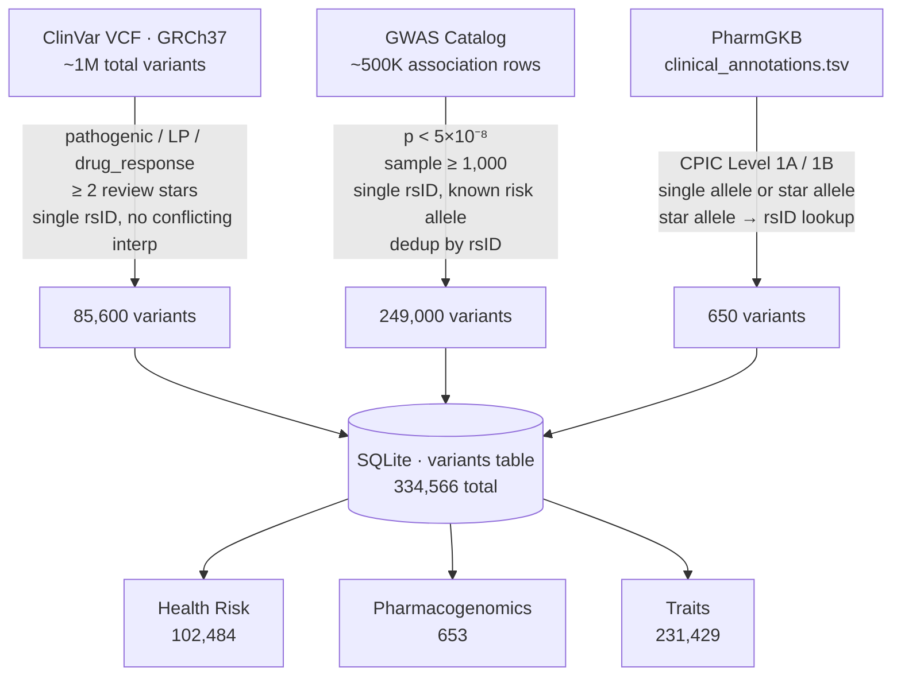
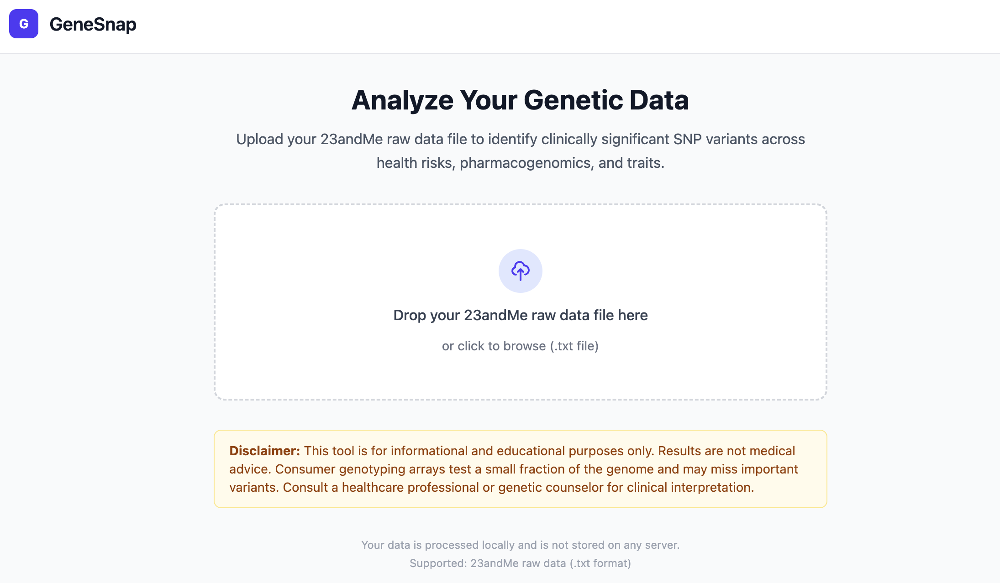
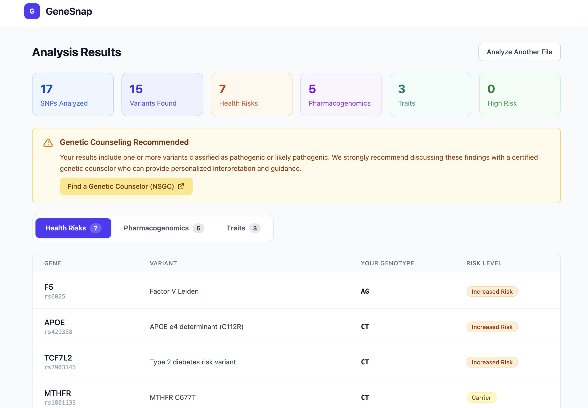
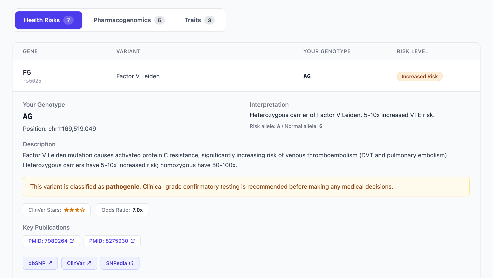

If you are like me, got a genetic testing like 23andme before you know better, you are not alone. But what did they say, when life give you lemon, make lemonade. Or even better, make a lemon cake, then have it, eat it, and even share it with everyone. 

I have deleted my account and requested to deleted my data with 23andme, but before deleting I also exported the raw data - a plain text file with ~600k rows, one per genetic position they tested. And most people never open it.

GeneSnap is a side project I built to change that. You drop in your raw 23andMe file, and in a few seconds it tells you which of your variants actually matter — flagged against reputable clinical databases, categorized by type, and linked to the research papers behind each finding.

Let me walk you through what it does and how it works.

---

## Why Build This?

23andMe's analysis was basic, you get your ancestry stuff, and you then have to pay extra for any additional health information. And even if you paied the extra, it shows you a curated slice of your data and soft-pedals anything medically significant. There are good reasons for that — liability, regulatory constraints, the fact that most users don't want to be alarmed — but it means a lot of the interesting stuff gets buried or glossed over.

The raw export is different. It's a tab-delimited file of every SNP (single nucleotide polymorphism) they genotyped — roughly 600,000 to 950,000 positions depending on your chip version. Each row is an rsID (a standard identifier like `rs6025`), a chromosome, a position, and your two-letter genotype.

There's nothing stopping you from cross-referencing that against ClinVar, the GWAS Catalog, PharmGKB, and other public databases yourself. GeneSnap just automates that.

**Important caveat upfront:** this is an informational tool, not a diagnostic one. Consumer genotyping tests ~0.02% of your genome. Clinically significant findings should always be confirmed with clinical-grade testing and discussed with a genetic counselor. That disclaimer isn't just legal boilerplate — it genuinely matters.

---

## What It Covers

GeneSnap organizes results into three buckets:

**Health Risks** — variants associated with disease susceptibility. Things like APOE (Alzheimer's risk), Factor V Leiden (blood clots), BRCA1/2 (hereditary cancer), HFE (hemochromatosis), and about 150+ others sourced from ClinVar's pathogenic/likely pathogenic classifications and well-replicated GWAS hits.

**Pharmacogenomics** — how your genes affect drug metabolism. The CYP450 enzyme family is the big one here: CYP2C19 variants affect how well you activate clopidogrel (a blood thinner), CYP2D6 affects codeine and many antidepressants, VKORC1 and CYP2C9 together determine warfarin sensitivity. This is the category where findings are most directly actionable.

**Traits** — lower-stakes associations like lactose tolerance, alcohol flush reaction (ALDH2), caffeine metabolism, and muscle fiber type. More conversation-starter than clinical, but well-established in the literature.

---

## Building the Variant Database

The most labour-intensive part of GeneSnap isn't the analysis — it's building the reference database that analysis runs against. There are three source pipelines, each pulling from a different public database and applying its own filters before variants land in SQLite.

### ClinVar

ClinVar is NCBI's archive of human variants with clinical interpretations. It ships as a gzipped VCF (GRCh37) that covers the whole genome — millions of entries. The import script filters it down hard:

- **Significance:** keep only `Pathogenic`, `Likely pathogenic`, `Pathogenic/Likely pathogenic`, and `drug_response`. Anything with `Conflicting_interpretations` is dropped.
- **Review status:** keep only variants with ≥ 2 ClinVar stars — meaning at least multiple submitters with no conflicts, or review by an expert panel. Zero- and one-star entries are too noisy.
- **Alleles:** skip multi-allelic sites (comma in ALT field) and entries without a mapped rsID.

After filtering: ~85,600 variants, mostly health risk and pharmacogenomics.

### GWAS Catalog

The GWAS Catalog is EBI's curated collection of genome-wide association study results. The full associations file has ~500,000 rows. Filters:

- **p-value:** p < 5×10⁻⁸ (the standard genome-wide significance threshold)
- **Sample size:** ≥ 1,000 participants in the initial cohort — removes underpowered studies
- **SNP field:** must be a single rsID (no haplotype blocks or intergenic annotations)
- **Risk allele:** must be a known, non-ambiguous allele (drops `?` and `N` entries)
- **Deduplication:** first association per rsID wins; subsequent rows for the same SNP are skipped

One extra step: if the reported OR < 1.0 (the "risk allele" is actually protective), alleles are swapped and the OR is inverted — so the database always stores the risk-increasing allele consistently.

After filtering: ~249,000 variants, skewing heavily toward traits and disease associations.

### PharmGKB

PharmGKB requires a manual download of `clinical_annotations.tsv` from their website (not available via open FTP). The filter is simple: keep only **CPIC Level 1A and 1B** annotations — the highest-confidence drug-gene pairs with peer-reviewed dosing guidelines. Multi-allele rows (diplotype descriptions like `CYP2C9*1, CYP2C9*3`) are skipped since they describe combinations rather than single variants. Star alleles (e.g. `CYP2D6*4`) are resolved to rsIDs via a curated lookup table.

After filtering: ~650 variants, all pharmacogenomics.

### How it flows



Each source runs as a separate import pass. ClinVar goes first because its ref/alt allele data gets reused downstream — GWAS Catalog doesn't always report reference alleles, so the script borrows them from the ClinVar lookup table to generate per-genotype interpretations. PharmGKB runs last and deduplicates against whatever's already in the DB with `INSERT OR IGNORE`, so manually curated seed entries always take priority.

The whole import takes a few minutes and produces a single portable SQLite file that ships with the app.

---

## The Backend Algorithm

The core analysis is simpler than you might expect, which is intentional.

When you upload your file, the parser streams through it line by line (you don't want to load 600K+ rows into memory at once), strips the comment header, skips no-call genotypes (`--`) and internal probe IDs, and produces a list of `SNP` objects — just rsID, chromosome, position, and genotype.

Then the analysis engine takes that list and fires a single SQL query:

```sql
SELECT * FROM variants WHERE rsid IN (1, 2, 3, ...)
```

against a local SQLite database of curated variants. No external API call, no ML model, just a lookup. Whatever matches gets categorized and sorted.

For sorting, each matched variant gets an **evidence score**:

```
score = significance_weight × (1 + clinvar_stars) × max(odds_ratio, 1.0)
```

Breaking that down:
- `significance_weight` encodes the type of evidence: pathogenic = 10, likely pathogenic = 8, risk factor = 5, drug response = 4, statistical association = 2
- `clinvar_stars` is ClinVar's review status (0–4), where more stars means more expert review
- `odds_ratio` is the effect size from GWAS data — how much more likely you are to have a trait if you carry the risk allele. If it's missing (common for ClinVar-only entries), it defaults to 1.0

The specific numbers (10, 8, 5, 4, 2) and weight are educated guesses, not calibrated against any ground truth - it just determines the sort order within each risk tier. High-risk variants float to the top; within the same risk level, stronger evidence comes first.

The odds ratio itself comes directly from the GWAS Catalog import, not calculated from scratch. One normalization step: if the raw OR < 1.0 (meaning the tested allele is *protective*, not risky), the alleles are swapped and the OR is inverted so the "risk allele" always has OR ≥ 1.

On-demand enrichment — ClinVar details, PubMed papers, Ensembl annotations — is lazy loaded when you click into a specific variant. Running all of that on upload would be too slow given API rate limits.

---

## The Stack

**Backend:** Python 3.12, FastAPI, SQLite via aiosqlite. No ORM — the schema is simple enough that raw SQL with typed query functions is cleaner. `uv` for package management, `ruff` for linting and formatting, `mypy` in strict mode.

**Frontend:** React 19, TypeScript, Vite, Tailwind CSS. No component library — Tailwind is fast enough for rapid UI work without pulling in a dependency you'll fight with later.

**Data sources for the curated DB:** ClinVar (pathogenic variants), GWAS Catalog (association data with effect sizes), PharmGKB (drug-gene interactions), and manually curated entries for well-established variants that don't fit neatly into those pipelines.

**External enrichment APIs** (on-demand, cached for 7 days): ClinVar E-utilities, Ensembl VEP, PubMed, GWAS Catalog, PharmGKB. Responses cached in a local `api_cache` table so you're not hammering the same endpoint twice.

---

## Running It

I have commited the code in my github repo, [GeneSnap](https://github.com/syao13/GeneSnap), feel free to check it out. It is also intentional that the uploaded data will NOT be stored anywhere, it runs the search, and then gets disgarded. 

When you first start the app, you will see this landing page.



After you upload a file, you can see your overall analysis results like this.



And for each identified gene, you can click on it to learn more.



---

## What's Next

The curated variant database is the main thing that needs ongoing work — there are hundreds of well-characterized variants that aren't in yet. Support for AncestryDNA's raw export format is also on the list. Polygenic risk scores (combining many small-effect variants into a single aggregate number) and population stratification are some of the longer-term ideas, though they come with their own statistical and ethical complexity. 

For now, if you have your 23andme raw data, or can still download your raw data, give it a try. The file is under your account settings — it's just a text file, and you might be surprised what's in there.

---

*GeneSnap is for informational purposes only and is not medical advice. Clinically significant findings should be confirmed with clinical-grade testing and reviewed with a genetic counselor.*
