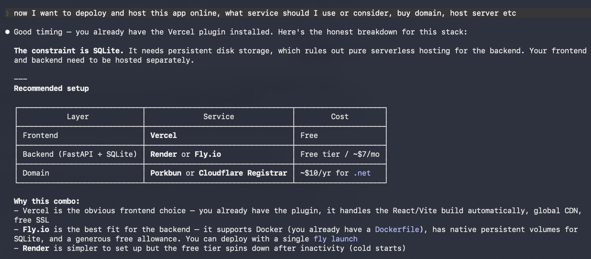
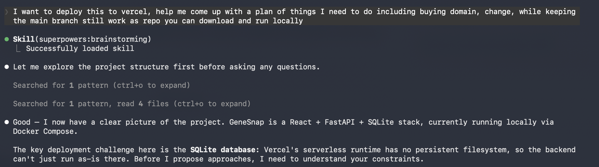
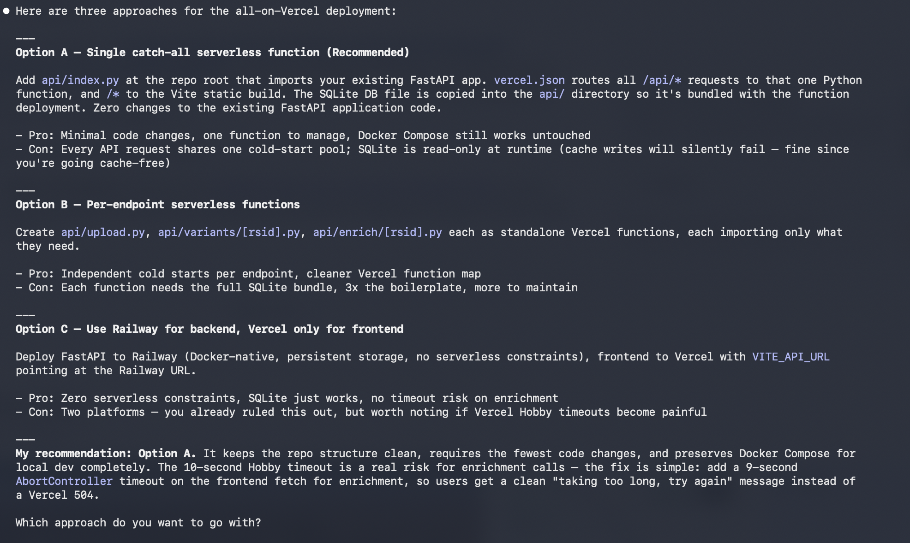

In my last blog post I built a web app that can analyze your 23andMe raw data results. This time I'll walk through how I got it deployed. You can check it out live at [https://www.genesnap.net/](https://www.genesnap.net/).

As anyone who programs would do nowadays, I asked Claude Code for help. My first ask was simple: recommend a hosting service based on my tech stack. Here's what it came up with:

To my surprise, its top suggestion was to host the frontend and backend separately — something like Vercel for the frontend and a dedicated backend hosting service alongside it. And with my limited web app deployment experience, that felt off. Especially since this is not a complicated backend: a SQLite database, one API call, and that's it. Why would I need a separate backend service for that?

So I started investigating. Google searches, Reddit threads, asking Claude to clarify, and no clean, definitive answer emerged. I get it: no two apps are exactly the same, and the "right" hosting setup depends heavily on your specific needs, scale, and budget. But at some point you have to make a call. And as they say, when in doubt, try it out. I decided to trust my gut and go all-in with Vercel.

And once I am determined on the direction, Claude then not surpurisingly  was able to quickly help me make it happen. Here are the options Claude laid out for me:

After I committed to a path, Option A if you must know, Claude was genuinely excellent at walking me through the operational side — which Vercel settings to configure, how to set up environment variables, debugging deployment errors, and getting everything live. It felt like a breeze.

## How your early tech choices ripple into deployment

Looking back, a lot of my deployment decisions were quietly shaped by choices I made at the very start of the project when I just wanted something that worked locally. SQLite was the obvious choice then — no setup, no connection strings, no extra accounts, just a file on disk. Fast to get going. But SQLite and serverless deployments have a complicated relationship. Serverless functions are stateless by design, spinning up and down on demand, which means you can't rely on a file sitting on disk persisting between requests.

This is something I had to reckon with when choosing how to deploy. The backend being "simple" doesn't mean the deployment is simple — it means the simplicity I had locally was partly borrowed from assumptions that don't hold in production. The database choice isn't just a detail you can swap out later; it's a constraint that shapes what hosting options are viable at all.

This is worth keeping in mind if you're starting a new project: the stack decisions you make in hour one, when you just want something running, will follow you when it's time to ship.

## From tech debt to understanding debt

I deployed GeneSnap and wrote this post about two weeks ago, and I deliberately held off publishing until I went back and actually understood what the code, configs, and deployment settings were doing, not just that they worked.

This is something I've been thinking about as AI-assisted coding becomes the default: the new liability isn't just tech debt. It's **understanding debt**. When a coding agent handles the boilerplate, the configuration, and the integration glue, it's easy to end up with a working app you don't fully understand. And that's fine for getting something shipped — but the moment something breaks, or needs to change, or you just want to explain it to someone, that gap shows up fast.

The goal I set for myself: before publishing, understand and be able to explain every piece of the code or deployment setup. It took a few evenings of reading docs and tracing through configs, but it was worth it. The app feels more mine now than it did the day it first deployed. We might be graduating from tech debt to understanding debt as the bigger challenge, and I'm not sure the industry has fully caught up to that yet.

---

*A few things I'm still thinking about writing: how the SQLite constraint got resolved in practice, a lessons-learned bullet list for anyone following a similar path, and whether Vercel's free tier limits become a problem as the app gets real traffic. Let me know if any of those would be useful.*
