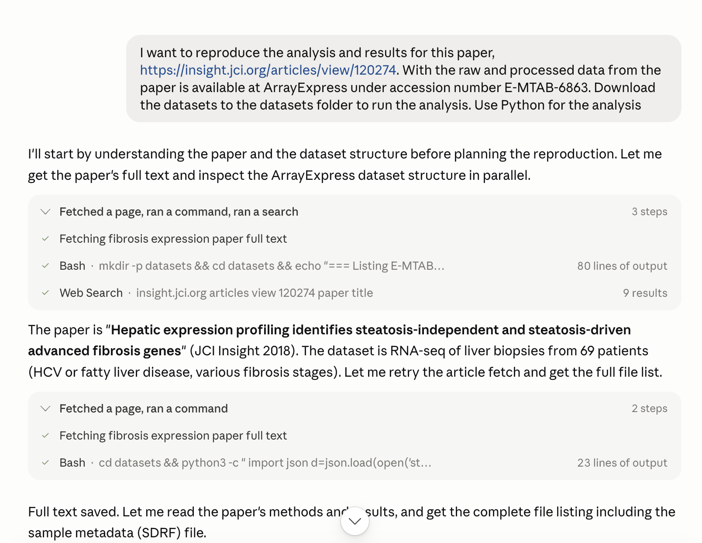
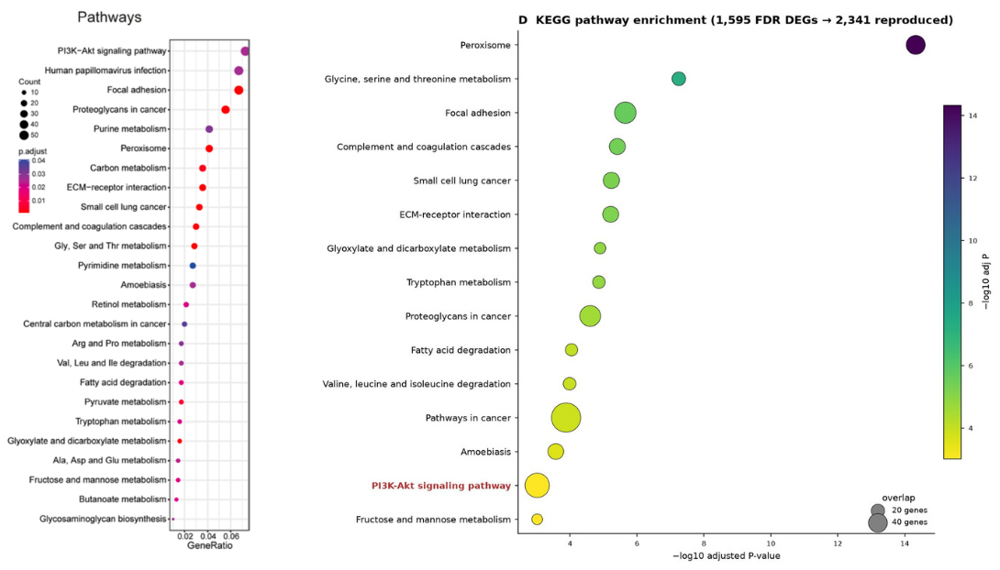
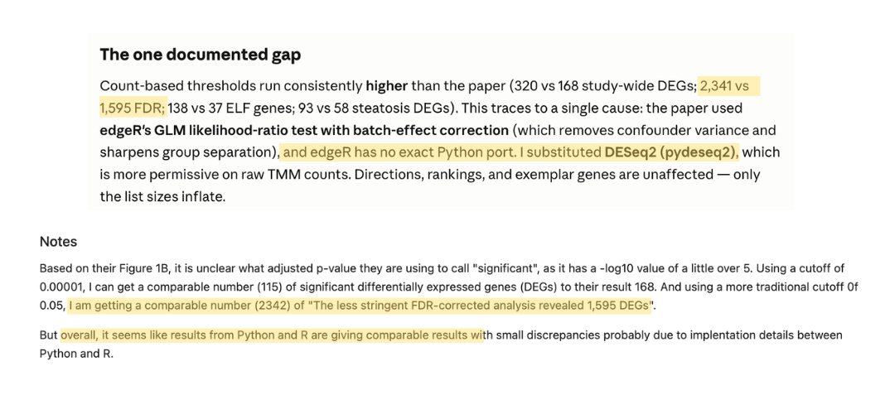
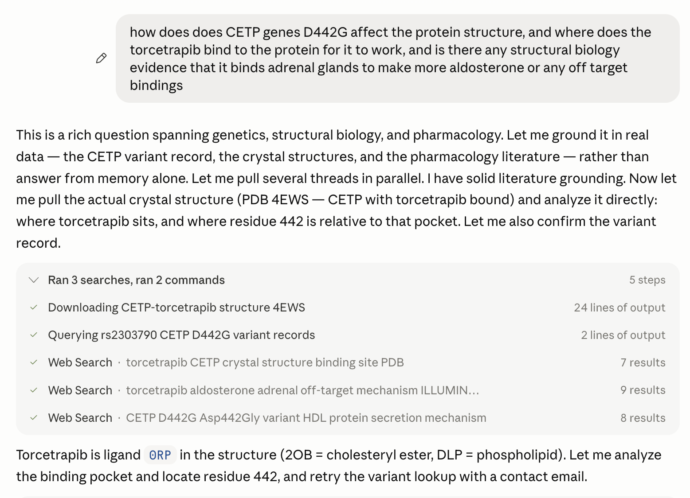
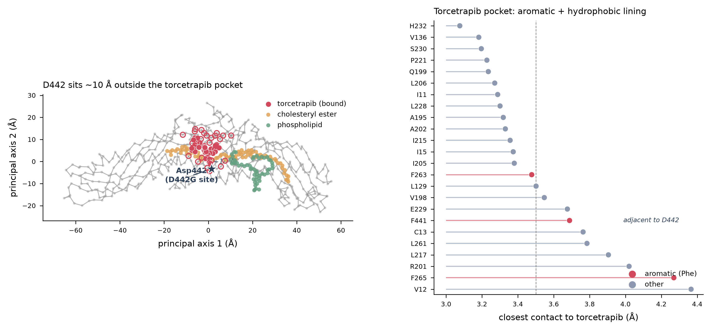

Claude Science is a new app on top of the Claude models, same family as Claude Code and Cowork. It's a desktop app, when you open it, it starts a local server and runs from there.

That choice is the interesting part. It's the same kind of call as Claude Code shipping in the terminal instead of an IDE: a little unexpected, and a bet about where the work actually happens. I suspect it may have some advantage in setting up in environment with highly sensitive data. Local server means the tool sits next to your data, your environment, and your compute, instead of a sandbox you upload things into. Though I have not yet been able find any definite explainations.

## Reproducing a paper

The first thing I tried was rebuilding the analysis and results from a published paper. I've wanted a tool like this for a while: hand it any paper, have it rerun the analysis, and use that to actually understand the work.

I picked a paper I tried to reproduce 2 years ago. The original was all in R, and back then I wanted to redo the whole thing in Python. The authors shared their data and that made it possible (credit to them). It took me about 2 weeks back then, [github link](https://github.com/syao13/fibrosis-progression-deseq2).

The first snag was small and annoying. Getting the paper into the tool was slow, even with every connector turned on. My guess is the publisher wasn't one of the big ones Claude Science handles smoothly. It couldn't pull the open-access PDF straight from the page, and it couldn't get the full text.

So on the first pass, it rebuilt the paper's whole analysis from the abstract alone. Not the full paper. The abstract. One paragraph in, and the output still looked plausible. That should give you pause.

On the second pass I gave it the PDF and asked it to redo the analysis properly. It rebuilt the paper in under 15 minutes and landed on nearly the same tables and figures as the orignal paper, and even explained some of the mismatches as R vs Python and old vs. new version of packages. I spot checked the notebook and it's close enough that I'd trust it for a first look.

*The pathway enrichment analysis from the paper (left) and from Claude Science (right)*

*Claude Science (top) was able to generate almost the exact same number as a notebook I ran about 2 years ago (bottom), which made me weirdly proud of myself.*

Here's the part that matters to me. The most valuable step in any analysis, for me, is the interactive EDA: checking every angle of the data, slicing it different ways until I understand what I'm actually looking at. A 15-minute rebuild gets me to results. It doesn't give me that understanding, and understanding is the reason I'd run the paper in the first place. The feeling of understanding why I got the number after 2 hours of digging through the underlaying algorithm used in pydeseq2 vs. edgeR is different than reading the numbers in 2 min build by Claude.

## Structural biology

Second task: check how does a compound bind to a protein to function. A simple question. I just wanted to see how they sit together.

It found the structures and pulled them down fine. The viewer is where it came up short. The intro video makes it look like you can manipulate and inspect any structure inside the tool. What it does today: download the PDB files and show the original structure, basic viewing through Mol*. No highlighting a residue, no dropping in a binding compound. For a first glance it's enough. For anything past a first glance, you leave the tool.

I think this is due to one of the main goals for the tool is to produce papers, so naturally the artifact it wants to make is a static image. Sure it provided the code it ran to produce the structure image, but that's not the point. The demos showed an interactive HTML mode, but you can only get it if ask specifically. Right now the structural side hands you off to other viewers to do the actual looking and beyound, and that's the part I'd most want built in.

## Cost

It's pricey. That one paper rebuild, about 15 minutes of work, drained roughly half my session limit. For a single section in a single session, that adds up fast. Anything with a lot of back-and-forth, which is most real research, is going to hit the ceiling quickly.

## Open source, and the bigger question

There are open source skills and agents worth trying in this space, such [open-science](https://github.com/ai4s-research/open-science), [openscience](https://github.com/synthetic-sciences/openscience), [biomini](https://biomni.stanford.edu/), [AI-Scientist](https://github.com/SakanaAI/AI-Scientist), just to name a few.

There is definitely a need for open source in this space. However upon a brief checking of these tools, I can't help but notice that most of them are build by a handful of contributors from the same group or company. The one thing I'd genuinely want is more openness here: a community building these science tools in the open, with roadmap designed by the community, instead of just publishing source code with an Apache 2.0 license. Thus, if a key member of a lab graduate, or a company decide to pivot, the open science continues to live. 

The models, skills, and agents are moving fast. Any one of them would probably would probably get you pretty far ahead. We're not short of tools nowadays. On the contrary, there might be too many, and sometimes the real cost is the time spent choosing between them. So stick with one, and just do a trial run.

My actual take after the session: if the research question is worth asking, I doubt the specific tool changes whether you can answer it or not. Would still be interesting to see a comparison across tools on the same question though.

## What I'd want next

- Structure viewing that works inside the tool: residue highlighting, ligands, no handoff to Mol*.
- A real EDA loop, not just a sprint to results.
- An actual open source community contributing in this space

Fast and capable is a good starting point, and the tool is worth a look if you have the budget for it. Having AI agent as a copilot in research is an unstopable trend. After a session with it, the thing I keep thinking about is the question I brought in. Ask a good question and most of these tools will get you there one way or another. That part is on you, and no app does it for you.