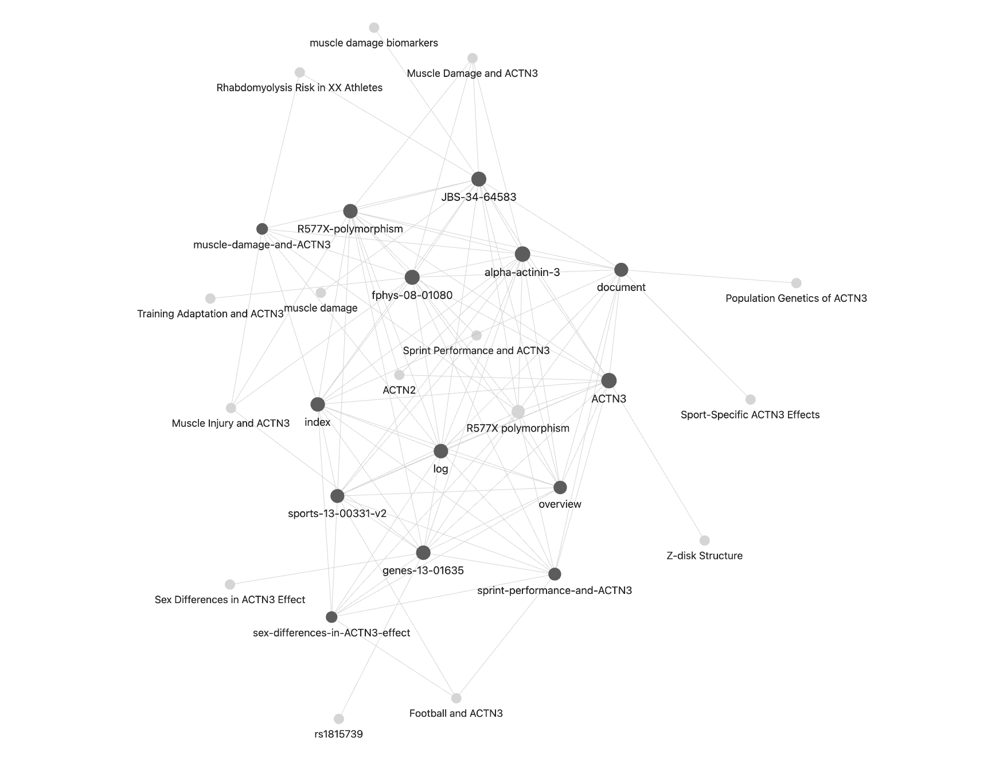

The LLM wiki by Andrej Karpathy has been gaining a lot of traction, [link](https://gist.github.com/karpathy/442a6bf555914893e9891c11519de94f). The core idea is to use llm to incrementally index, organize, query, and maintain a persistent wiki. [add more here]

The approach is very interesting in that you are now using llm to interact with your knowledge base dynamically. [add more here] 

So I decided to give this a try, using gene ACTN3 and rs1815739 variant as an example.

## Colloect raw data

To get started, I need to collect some information on the gene first. I started with google search of the gene and downloaded a few papers that's the top hit. If you have an existing projct with many papers, slides, notebooks, etc. already, just collect everything into a folder. 

## Initiate the llm wiki

The original llm-wiki blog post has clear instrunction and enough background information aleady, which can be directly used by your coding agent to follow as a set of rules. So to start I simply copied the markdown file to the project root folder.

```
project-root/
├── raw/
│   ├── xxx.pdf
│   └── ...
└── llm-wiki.md
```

For Clause, run `/init` under the root folder, and Claude easily understood the purpose of the project and rewrote it as a project specific guideline. 

```
project-root/
├── raw/
│   ├── xxx.pdf
│   └── ...
├── CLAUDE.md
└── llm-wiki.md
```

## Indexing your intial raw files

After that, run `Ingest` or a more specific instruction prompt in Claude, and you will get an organized wiki folder with a overview page and relevant entity, source, and concept pages across the wiki.


```
project-root/
├── CLAUDE.md
├── llm_wiki.md
├── folder-structure.md
├── raw/
│   ├── xxx.pdf
│   └── ...
└── wiki/
    ├── index.md
    ├── log.md
    ├── overview.md
    ├── concepts/
    │   ├── xxx.md
    │   └── ...
    ├── entities/
    │   ├── xxx.md
    │   └── ...
    └── sources/
    │   ├── xxx.md
    │   └── ...
```

## Visulize your wiki

[Obsidian](https://obsidian.md/) is what made this wiki magical. Since this wiki is made of interlinked markdown files, you can open the wiki folder as a vault in Obsidian and check the graph view for all the connections between concept. 



## Enrich your wiki

As you add more documents to the raw folder and have your coding agent to `Ingest` again. But a more insterting way of adding to your wiki is `Query` your wiki using your coding agent. Good questons and answers can be added back to the wiki and become part of the knowledge base. 

## Summary

LLM makes building the wiki easy, but to make sense of the information collected and presented is more crucial than ever. We are not building the tool just to build it, we are building the tool so we can understand the science behind it and advance it in any way possible. [add more here]
